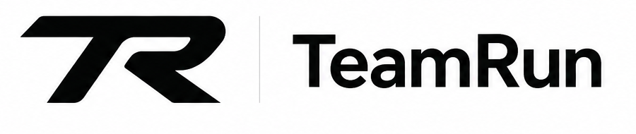

<div align="center">
  <a href="https://github.com/wangzhengzhuo05/TeamRun">
    
  </a>

  <p><strong>One team. Many agents. Run together.</strong></p>

  <p>
    TeamRun is a human-agent collaboration workspace for software teams.<br />
    Bring team context into parallel agent runs, review the work locally, and publish the result when it is ready.
  </p>

  <p>
    <a href="https://github.com/wangzhengzhuo05/TeamRun/releases/latest"><strong>Download TeamRun</strong></a>
    · <a href="docs/TeamRun_prd/MVP_IMPLEMENTATION.md">MVP implementation</a>
    · <a href=".github/CONTRIBUTING.md">Contributing</a>
  </p>

  <p>
    <a href="https://github.com/wangzhengzhuo05/TeamRun"></a>
    <a href="https://github.com/wangzhengzhuo05/TeamRun/releases"></a>
    
    
  </p>

  <p>
    <sub><a href="docs/readme/README.zh-CN.md">中文</a> · <a href="docs/readme/README.ja.md">日本語</a> · <a href="docs/readme/README.ko.md">한국어</a> · <a href="docs/readme/README.es.md">Español</a> · <a href="docs/readme/README.fr.md">Français</a> · <a href="docs/readme/README.pt.md">Português</a></sub>
  </p>
</div>

<p align="center">
  
</p>

## The human-agent loop

```text
Team Task + discussion + docs
              ↓
      Immutable context snapshot
              ↓
       Personal Workspace
       ├─ one or more Agent runs
       ├─ isolated worktrees or folders
       └─ local verification
              ↓
       Human review and comparison
              ↓
     Publish selected results to Team Space
```

TeamRun keeps execution close to the developer while giving the team a clear,
reviewable path from task to result.

## Three surfaces, one workflow

<table>
<tr>
<td width="33%" valign="top">

### Team Space

The shared layer for organizations, members, projects, repositories, tasks,
channels, comments, and reusable Team Agents.

</td>
<td width="33%" valign="top">

### Personal Workspace

The execution layer for terminals, multiple agents, Git worktrees, folder
workspaces, diffs, tests, and run comparison.

</td>
<td width="33%" valign="top">

### Context Bridge

Freeze task context before launch, send it to one or more agents, then publish
only the reviewed artifacts back to the team.

</td>
</tr>
</table>

## What you can do

- Run Claude Code, Codex, OpenCode, Cursor CLI, GitHub Copilot CLI, Gemini CLI,
  Pi, or any other CLI agent side by side.
- Give each run an isolated Git worktree or folder workspace and keep the
  working state visible in one place.
- Inspect diffs, run project verification commands, compare agent runs, and
  decide what is ready to ship.
- Work locally, over direct SSH, or on a capability-negotiated remote runtime.
- Browse source-control and task context without losing the workspace where the
  work is happening.
- Monitor and steer work from the [TeamRun Mobile companion](mobile/README.md).
- Script repeatable workflows with the [`teamrun` CLI](skill-guides/orca-cli.md).

<table>
<tr>
<td width="50%" valign="top">
  
  <p><strong>Parallel worktrees</strong><br />Compare independent approaches without mixing their files.</p>
</td>
<td width="50%" valign="top">
  
  <p><strong>Terminal and editor workspace</strong><br />Keep terminals, files, diffs, and agent sessions in one flow.</p>
</td>
</tr>
<tr>
<td width="50%" valign="top">
  
  <p><strong>Remote execution</strong><br />Use a powerful remote box without giving up the TeamRun workspace.</p>
</td>
<td width="50%" valign="top">
  
  <p><strong>Mobile companion</strong><br />Check status, read output, and send follow-up commands from your phone.</p>
</td>
</tr>
</table>

## Supported agents

TeamRun is agent-neutral: if an agent runs in a terminal, it can run in
TeamRun. Built-in presets cover popular coding agents, and Team Space also
supports trusted generic CLI commands for team-specific tools.

## Install

### Desktop — macOS, Windows, Linux

Download the latest build for your platform:

- [macOS Apple Silicon](https://github.com/wangzhengzhuo05/TeamRun/releases/latest/download/teamrun-macos-arm64.dmg)
- [macOS Intel](https://github.com/wangzhengzhuo05/TeamRun/releases/latest/download/teamrun-macos-x64.dmg)
- [Windows installer](https://github.com/wangzhengzhuo05/TeamRun/releases/latest/download/teamrun-windows-setup.exe)
- [Linux AppImage](https://github.com/wangzhengzhuo05/TeamRun/releases/latest/download/teamrun-linux.AppImage)
- [All releases](https://github.com/wangzhengzhuo05/TeamRun/releases/latest)

For a headless Linux runtime, see the [headless Linux server guide](docs/reference/headless-linux-server.md).
For a self-hosted mobile connection, see the [Mobile Relay guide](docs/reference/self-hosted-mobile-relay.md).

### Mobile companion

The React Native companion app lives in [`mobile/`](mobile/). See its
[development and pairing guide](mobile/README.md) for Expo, iOS, Android, and
desktop connection instructions.

## Run Team Space locally

Team Space is backed by the Fastify API in `src/services/teamrun-api` and the
versioned contracts in `src/packages/teamrun-contracts`. Local Team Space
development requires Node.js 24, pnpm through Corepack, and Docker Compose.

Start PostgreSQL and the S3-compatible object store:

```bash
docker compose -f config/teamrun/compose.yaml up -d
```

Build the contracts, migrate the database, and start the API:

```bash
corepack pnpm install
corepack pnpm teamrun:build
corepack pnpm teamrun:db:migrate
corepack pnpm teamrun:dev
```

In another shell, start the desktop with local Team Space authentication:

```bash
TEAMRUN_API_URL=http://127.0.0.1:4310 TEAMRUN_DEV_AUTH=1 corepack pnpm dev
```

The API health check is available at `http://127.0.0.1:4310/health`. The full
MVP setup, production configuration, and compatibility contract are documented
in [`MVP_IMPLEMENTATION.md`](docs/TeamRun_prd/MVP_IMPLEMENTATION.md).

## Privacy by default

Workspace paths, prompts, uncommitted files, diffs, and verification output
stay local. Team context and run metadata are shared with Team Space, while
only artifacts explicitly selected in the Publish dialog are uploaded.

Offline reads use the last identity-scoped response. Supported writes are kept
in an ordered, idempotent outbox and can be retried when the connection returns.

## Repository map

```text
src/main/                         Electron main process, runtime, Git, SSH, and CLI
src/renderer/src/                 Desktop React application
src/packages/teamrun-contracts/   Versioned Team Space contracts
src/services/teamrun-api/         Team Space API and database migrations
mobile/                           React Native / Expo companion app
docs/TeamRun_prd/                 Product definition and MVP operations guide
```

Useful development commands:

```bash
corepack pnpm dev
corepack pnpm lint
corepack pnpm typecheck
corepack pnpm test
corepack pnpm test:e2e
```

See [CONTRIBUTING.md](.github/CONTRIBUTING.md) before opening a pull request.

## License

TeamRun is free and open source under the [MIT License](LICENSE).
